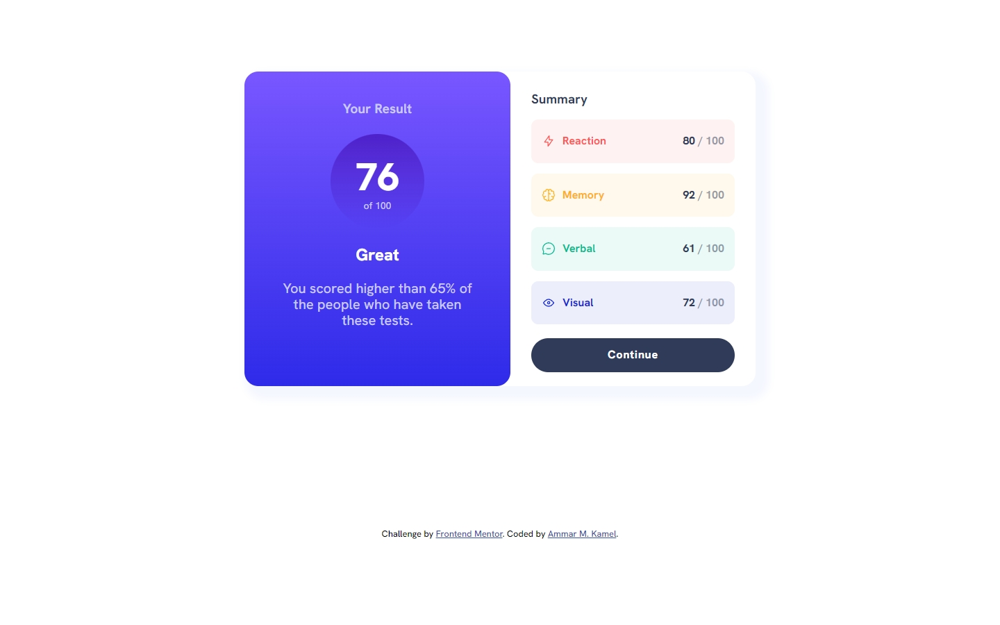

# Frontend Mentor - Results summary component solution

This is a solution to the [Results summary component challenge on Frontend Mentor](https://www.frontendmentor.io/challenges/results-summary-component-CE_K6s0maV). Frontend Mentor challenges help you improve your coding skills by building realistic projects. 

## Table of contents

- [Overview](#overview)
- [Screenshot](#screenshot)
- [Links](#links)
- [Built with](#built-with)
- [Author](#author)

## Overview

- This is a simple HTML and CSS Project.
- It is a card that shows the result of an IQ exam and its summary.

## Screenshot

## Links

- Solution URL: [GitHub Repo](https://github.com/AmmarMKamel/result-summary-component)
- Live Site URL: [Result Summary Component](https://ammarmkamel.github.io/result-summary-component/)

## Built with

- Semantic HTML5 markup
- CSS custom properties
- Flexbox
- Mobile-first workflow

## Author

- GitHub - [AmmarMKamel](https://github.com/AmmarMKamel)
- Frontend Mentor - [@AmmarMKamel](https://www.frontendmentor.io/profile/AmmarMKamel)
- Linkedin - [Ammar Kamel](https://www.linkedin.com/in/ammar-kamel-872422246/)